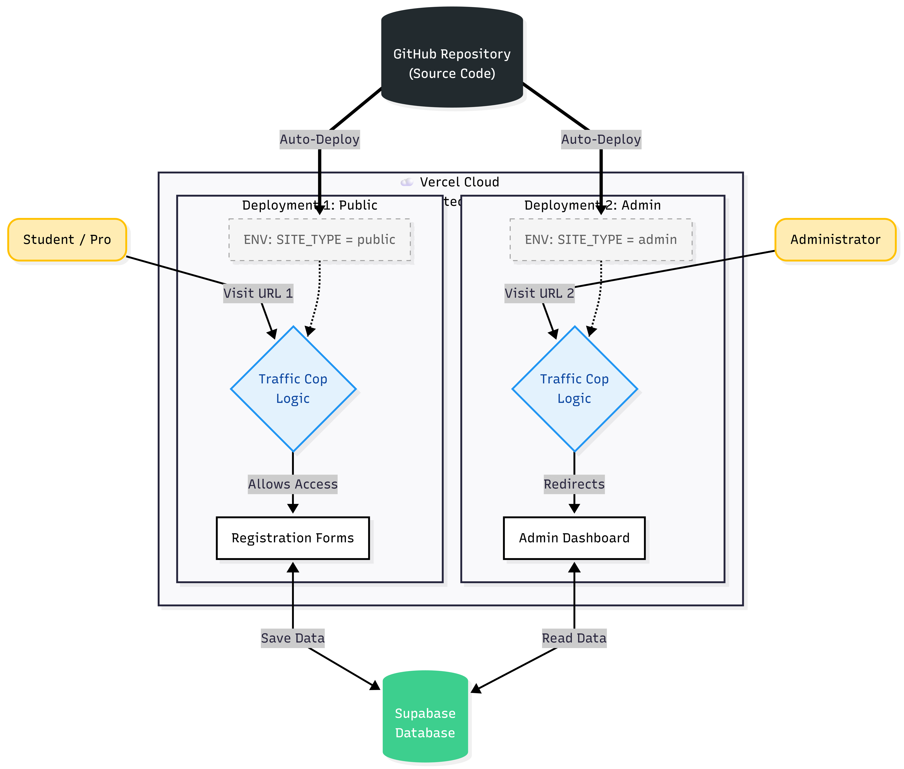

# Conference Registration System

This project is a web-based registration platform designed to handle event sign-ups for students and professionals. It uses Supabase for the backend database and Next.js for the frontend.

## Live Deployments

Per the project requirements, the application has been deployed as two separate portals using a single codebase.

* **Public Registration Portal:** https://conference-registration-system.vercel.app/
    * *Usage:* For public users to register as Students or Professionals. Access to the admin dashboard is blocked on this URL.
* **Admin Portal:** https://conference-admin-portal.vercel.app/
    * *Usage:* For administrators to view and manage registrations. This URL redirects immediately to the dashboard and bypasses the landing page.

## System Architecture



### Architecture Breakdown
As illustrated in the diagram above, the system relies on a **"Single Repo, Dual Deployment"** strategy:

1.  **Source Control (Top):** A single GitHub repository holds the code. When updates are pushed, they trigger distinct "Auto-Deploy" pipelines for both the Public and Admin projects.
2.  **Traffic Control (Middle):** The core logic relies on Next.js Middleware (labeled "Traffic Cop Logic" in the diagram).
    * **Left Flow:** On the Public site, the environment variable `SITE_TYPE` is set to `public`. The middleware detects this and explicitly **allows access** to registration forms while blocking the admin panel.
    * **Right Flow:** On the Admin site, the environment variable is set to `admin`. The middleware detects this and **redirects** all traffic immediately to the Admin Dashboard.
3.  **Data Persistence (Bottom):** Despite having two separate frontend URLs, both deployments connect to the same **Supabase Database**. This ensures that when a student saves data on the Public Portal, the Administrator can immediately read that data on the Admin Portal.

## Technical Stack

* **Framework:** Next.js 15 (App Router)
* **Language:** TypeScript
* **Styling:** Tailwind CSS
* **Database:** Supabase (PostgreSQL)
* **Deployment:** Vercel (Multi-project deployment)

## Development & Deployment Journey

This section documents the specific challenges and architectural decisions made during the development process, particularly regarding the separation of concerns between the user and admin views.

### The Strategy
Initially, the application was designed as a single cohesive website where the Admin Dashboard was simply a protected route (`/admin`). However, the requirements shifted to necessitate a completely separate "Admin Site" to ensure security and separation of user interfaces.

Instead of duplicating the code into two separate repositories—which would make maintenance difficult—I implemented the middleware-based architecture shown in the diagram.

**How it works:**
1.  We use a single GitHub repository.
2.  We deployed the repository to Vercel twice (creating two separate projects).
3.  We used an Environment Variable named `NEXT_PUBLIC_SITE_TYPE` to control behavior:
    * If set to `public`, the middleware blocks all `/admin` routes.
    * If set to `admin`, the middleware forces a redirect to the dashboard.

### Challenges and Mistakes
The deployment process was the most complex part of this project. We encountered and resolved several specific issues:

1.  **Middleware Placement:** A significant amount of time was spent debugging why the route protection wasn't working. The root cause was placing the `middleware.ts` file inside the `app/` directory. Next.js requires this file to be in the project root. Moving it fixed the routing logic.
2.  **Environment Variables:** We faced issues with Vercel's strict naming conventions for environment variables (specifically regarding hyphens vs. underscores) and realized that variables are not reactive; the project must be redeployed for variable changes to take effect.
3.  **Git & Security:** We initially had to scrub the repository history to ensure Supabase secrets were not committed to the public GitHub history, enforcing the use of `.env.local` for local development.

## Setup Instructions

### Prerequisites
* Node.js installed
* A Supabase account and project

### Local Installation
1.  Clone the repository:
    ```bash
    git clone [https://github.com/The-YogeshK/conference-registration-system.git](https://github.com/The-YogeshK/conference-registration-system.git)
    ```
2.  Install dependencies:
    ```bash
    npm install
    ```
3.  Create a `.env.local` file in the root directory and add your Supabase credentials:
    ```env
    NEXT_PUBLIC_SUPABASE_URL=your_supabase_url
    NEXT_PUBLIC_SUPABASE_ANON_KEY=your_supabase_anon_key
    NEXT_PUBLIC_SITE_TYPE=public
    ```
4.  Run the development server:
    ```bash
    npm run dev
    ```

### Deployment Configuration (Vercel)
To replicate this setup on Vercel:

1.  **Project 1 (Public Site):**
    * Import repository.
    * Set `NEXT_PUBLIC_SITE_TYPE` to `public`.
    * Deploy.

2.  **Project 2 (Admin Site):**
    * Import the same repository again.
    * Name it `conference-admin-portal`.
    * Set `NEXT_PUBLIC_SITE_TYPE` to `admin`.
    * Deploy.